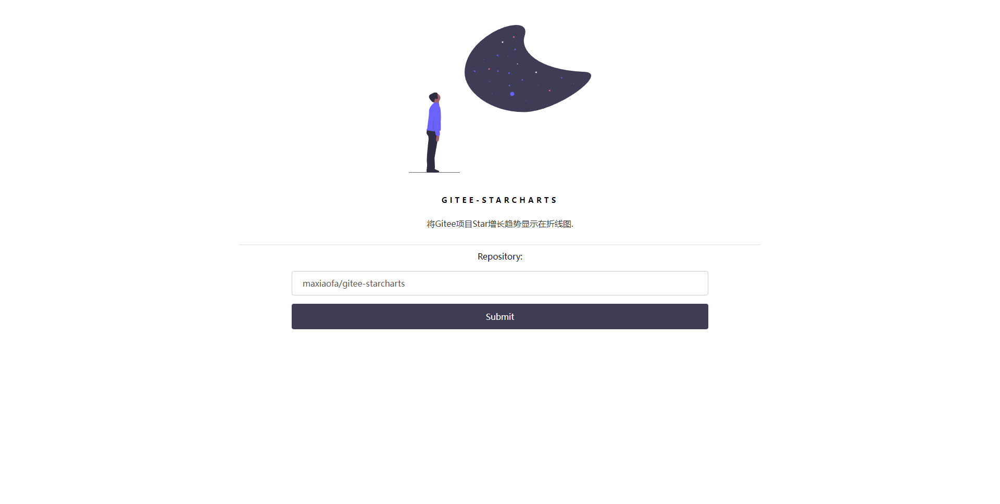
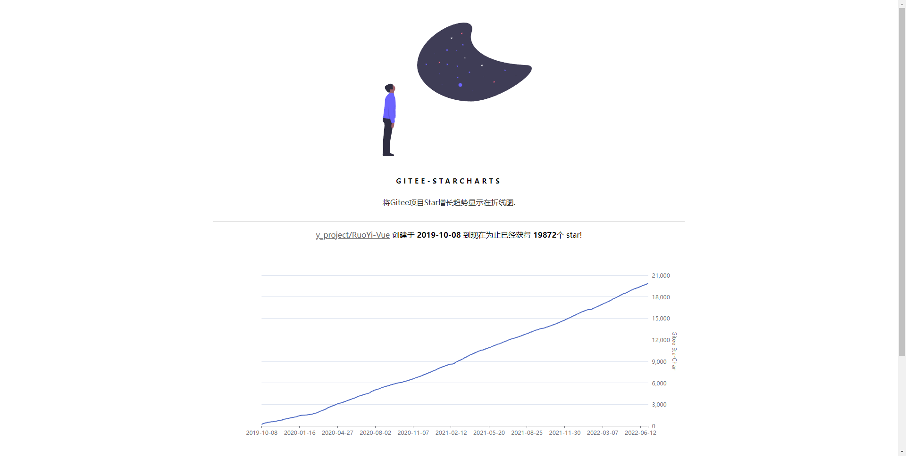
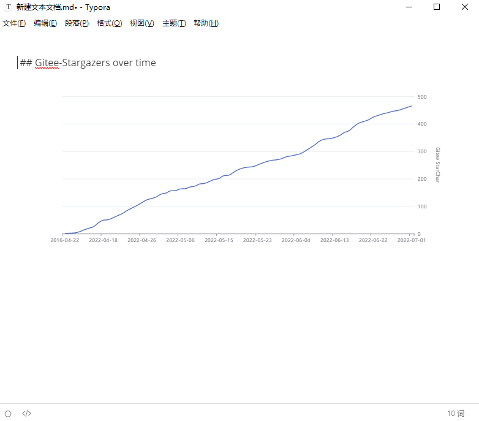

# Gitee-Stargazers

在折线图中展示Gitee项目Star趋势(Gitee 版starchart.cc)

## 使用方法

### NPM

运行前请先将`config/config.js`中配置替换成自己的

需要创建一个Gitee第三方应用, 参考: [Gitee 创建应用流程](https://gitee.com/api/v5/oauth_doc#/list-item-3)

````shell
npm install
````

``` shell
npm run start
```

启动成功后访问 http://localhost 既可

## 效果图






